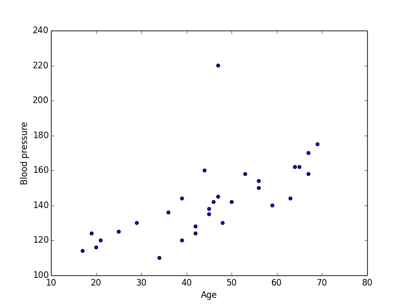
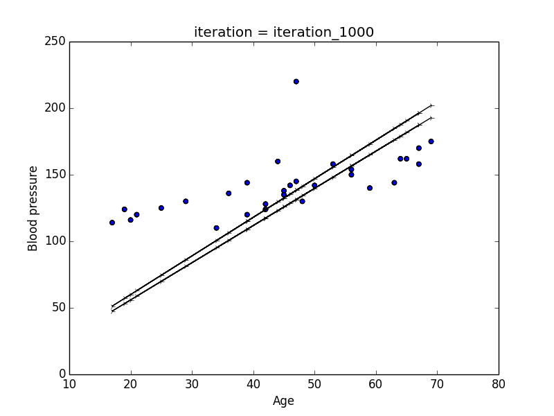
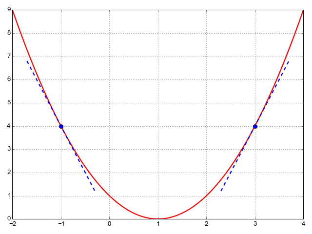

### 3分钟 机器学习-线性回归-梯度下降法

生活中，我们偶尔需要会做个线性回归来预测或者说想找出一个规律

假设我们想知道人类的年龄和血压的关系，那么我们找个几个人，然后测量了一下他们的血压， 然后把这些点画出起来，我们就大概的知道血压和年龄之间的关系了[血压和年龄](https://people.sc.fsu.edu/~jburkardt/datasets/regression/x03.txt)

让我们再稍微简化一下问题，假设血压和年龄的关系是线性的 y=mx+b，
那么我们怎么找这样一根具有代表性的线呢？  
找到之后，我们怎么确定这就是我们需要的线呢？  
下面的两根都是线，你觉得哪一根比较有代表性呢？  

##### 让我们定义一个反馈机制
直觉上来说，如果预测的y和真实的y之间的差距越小，那说明这根线越准确
为了确保反馈机制可以概括所有的点，我们把y的变化量的和相加，对于y的变化量是负值的情况，我们做一个平方，最后取一个平均值  

这样的反馈机制，在机器学习里我们叫价格函数（cost function)  

那么我们的问题就变成了求最小值问题

回顾一下，微分的结果显示了斜率以及移动方向，举个例子  

如果斜率是正的，那么我们需要向负的方向走才回到最小值，如果斜率是负的，那么我们需要走正的方向，当斜率为0的时候，我们就在最小值的地方

