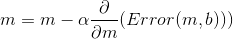
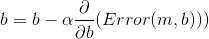
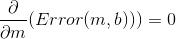
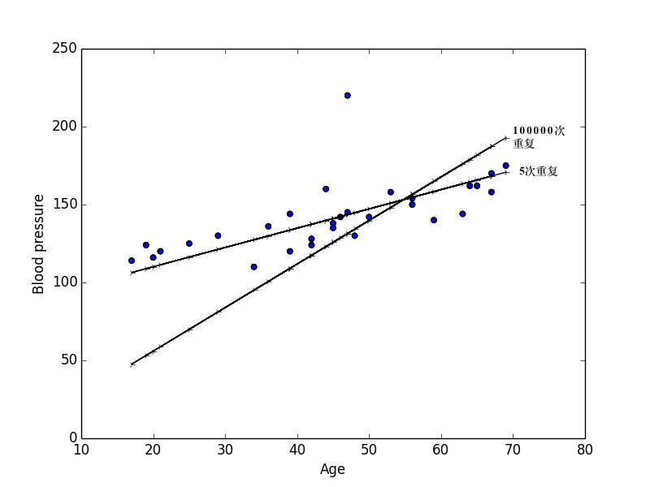

### 3分钟 机器学习-线性回归-梯度下降法（Gradient Descent)

假设我们想知道人类的年龄和血压的关系，那么我们找个几个人，然后测量了一下他们的血压， 然后把这些点画出起来，我们就大概的知道血压和年龄之间的关系了[血压和年龄](https://people.sc.fsu.edu/~jburkardt/datasets/regression/x03.txt)

让我们再稍微简化一下问题，假设血压和年龄的关系是线性的 y=mx+b，
那么我们怎么找这样一根具有代表性的线呢？  
找到之后，我们怎么确定这就是我们需要的线呢？  
下面的两根都是线，你觉得哪一根比较有代表性呢？

##### 让我们定义一个反馈机制
直觉上来说，如果预测的y和真实的y之间的差距越小，那说明这根线越准确
为了确保反馈机制可以概括所有的点，我们把y的变化量的和相加，对于y的变化量是负值的情况，我们做一个平方，最后取一个平均值  

这样的反馈机制，在机器学习里我们叫价格函数（cost function)

那么我们的问题就变成了求最小值问题

#### 算法
回顾一下，微分的结果显示了斜率以及移动方向，举个例子  

如果斜率是正的，那么我们需要向负的方向走才回到最小值，如果斜率是负的，那么我们需要走正的方向，当斜率为0的时候，我们就在最小值的地方

假设我们从 m = 0, b = 0开始寻找最小值，
每次我们需要改变一点m和b的值，使我们的价格函数每次都变小一点，
重复这个过程直到我们找到最小值

这个过程中，我们怎么改变m和b的值可以使价格函数变小呢 ？ 
这里我们回到刚才说过的，向斜率的反方向移动会靠近最小值，那么这就很简单了  

   

α (alpha)是我们的学习速率(恒大于0)，它意味这我们每次更新b,m的一个快慢  
然后这里一个很关键的技巧是我们需要同时更新b和m，因为不这样做，那么我们的结果会被先更新的那个变量所影响

当我们找到最小值的时候    , 这意味着m不再变了，当m和b都不再变的时候，我们就找到了最合适的线性关系

##### 看一下结果

#### 坑
重复5次大概不到0.01秒  
重复100000花了22秒钟  
纯梯度下降法其实很慢，有什么办法可以让它快一点？

在这个血压和年龄的简易模型里，我们可以通过价格函数找到一个最小值，但是有的时候，复杂函数里我们会面对这个本地最小值并不是全局最小值，那怎么办？

下期我们会来看看这些问题

